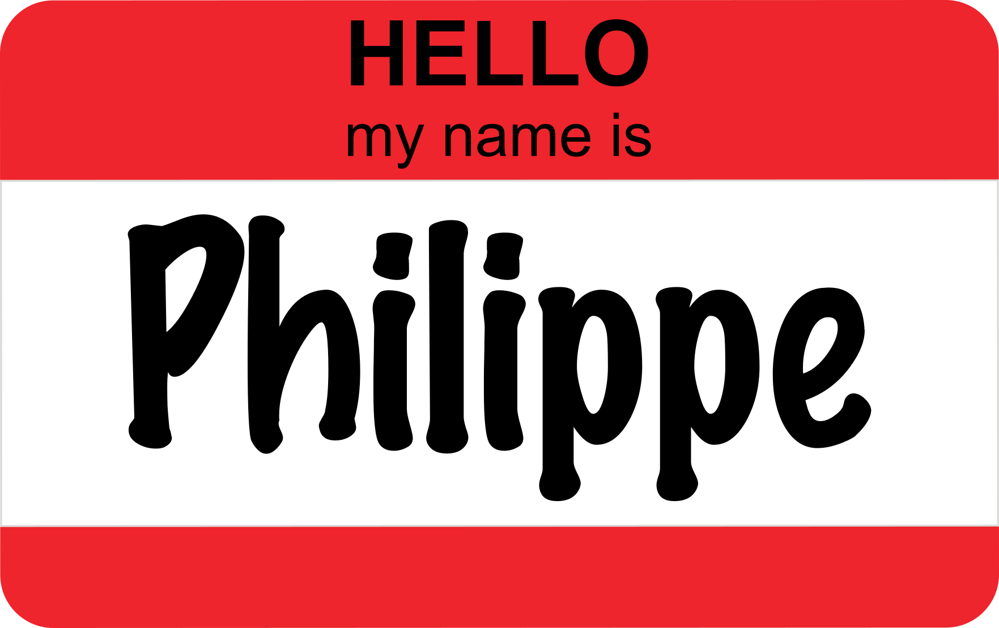

```{r setup, include=FALSE}
knitr::opts_chunk$set(echo = FALSE)
```

<center>

</center>

**Mail:** **[philippe.massicotte@takuvik.ulaval.ca](philippe.massicotte@takuvik.ulaval.ca)**

**Github page:** **[https://github.com/PMassicotte](https://github.com/PMassicotte)**

## GreenEdge physics paper

For a total of 194 sampling days!

## Atmosphere and ice

Data available daily:

- Cloud optical thickness (MODIS L3, resolution: 1 x 1 degree)
- Cloud fraction (MODIS L3, resolution: 1 x 1 degree)
- SST (AVHRR, resolution: 0.25 x 0.25 degree)
- Sea ice extent (NSIDC, resolution: 1 km)
- Sea ice concentration (AMSR2, resolution: 3.125 km)
- Windspeed (CCMP, resolution: 0.25 x 0.25 degree)

## Example: SST


## Example: Wind speed


## 360 degrees ice-cam

12 images taken simultaneously every 5 minutes


## Panorama


Panoramas: thanks to Simon Morisset (ULAVAL)

## A bit of geometry


## Ice detection


## Whats next?

- How do we integrate extracted data to the physic paper? 
- Better algorithm for ice detection (help?)