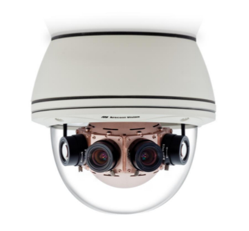
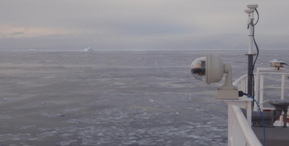

```{r setup, include=FALSE}
knitr::opts_chunk$set(echo = FALSE)
```

<center>

</center>

**Mail:** [philippe.massicotte@takuvik.ulaval.ca](philippe.massicotte@takuvik.ulaval.ca)

**Github page:** [https://github.com/PMassicotte](https://github.com/PMassicotte)

## Green Edge

### Physical paper

Working title: **Upper ocean physics of Baffin Bay marginal ice zone** <small>(Dumont, Houssais, Sévigny, Massicotte, Vladoiu, Bouruet-Aubertot, Rehm)</small>

### Tasks

- Use remote sensing products to characterize the state of the atmosphere for both Green Edge missions (194 sampling days).

## Atmosphere and ice

### Data available daily:

- Cloud optical thickness (MODIS L3, resolution: 1 x 1 degree)
- Cloud fraction (MODIS L3, resolution: 1 x 1 degree)
- SST (AVHRR, resolution: 0.25 x 0.25 degree)
- Sea ice extent (NSIDC, resolution: 1 km)
- Sea ice concentration (AMSR2, resolution: 3.125 km)
- Windspeed (CCMP, resolution: 0.25 x 0.25 degree)

## Example: Ice extent


## Example: Wind speed


## Data exploitation

- Different file formats (netCDF, HDF4, HDF5, etc.).
- Different ways to represent geographical coordinates (mapped, L3BIN, etc.).
- Processed in a way to make it rapidly exploitable (R, Matlab).

```{r}
library(ncdf4)
f <- nc_open("../data/sst/2015/avhrr-only-v2.20150401.nc")
sst <- ncvar_get(f, "sst")
sst <- as.vector(sst)

lat <- ncvar_get(f, "lat")
lon <- ncvar_get(f, "lon")

latlon <- expand.grid(lat, lon)

df <- tibble::data_frame(
  latitude = latlon$Var1,
  longitude = latlon$Var2,
  sst
)

df <- na.omit(df)

knitr::kable(head(df))

```

```{r, echo = TRUE, eval = FALSE}
source("download_data.R")
```


## 360 degrees ice-cam

> The Canadian research icebreaker CCGS Amundsen is equipped with a numeric
photography system which covers the sea surface at 360° around the vessel. His purpose
is to estimate the sea ice coverage, his appearance and his distribution within a radius of
~250 meters.

## 360 degrees ice-cam

<center>
<div class="parent">
  
  <em><small>The Arecont camera (model AV20185 IP camera)</small></em>
</div>
</center>

## 360 degrees ice-cam

<center>
<div class="parent">
  
  <em><small>The Arecont camera (model AV20185 IP camera)</small></em>
</div>
</center>

## 360 degrees ice-cam

12 images taken simultaneously every 5 minutes from the Amundsen


## Panorama


<em><small>Panoramas: thanks to Simon Morisset (ULAVAL)</small></em>

**Dimensions:** 950 x 13304 pixels (*n* = 12 638 800)

**Spatial resolution:** ~45 cm

## Spatial projection

<center>
<div class="parent">
  
</div>
</center>

## Ice detection

<center>
<div class="parent">
  
</div>
</center>

## 360 degrees ice-cam

Each image is georeferenced

```{r, warning=FALSE, message=FALSE}
library(tidyverse)
source("../R/ice_cam_functions.R")
df <- read_parameter("../data/ice-cam/Camera360_20160611134049_header.txt") %>% 
  gather(parameter, value)

knitr::kable(head(df, 11))
```

## 360 degrees ice-cam

### Map of available observations

## Whats next?

- How do we want to exploit the extracted data in the physic paper?
- Better algorithm for ice detection (help?)
- Contributions are welcome (https://github.com/PMassicotte/green-edge)

## Thank you
