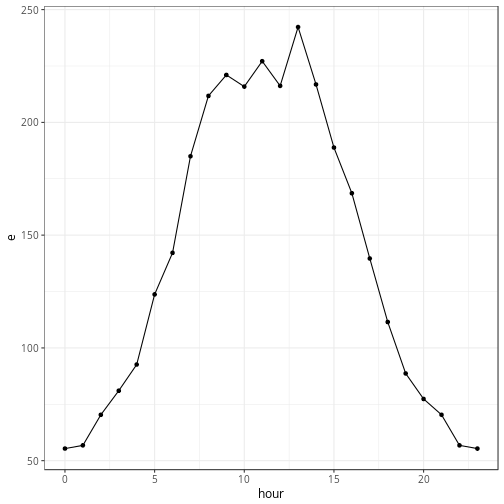
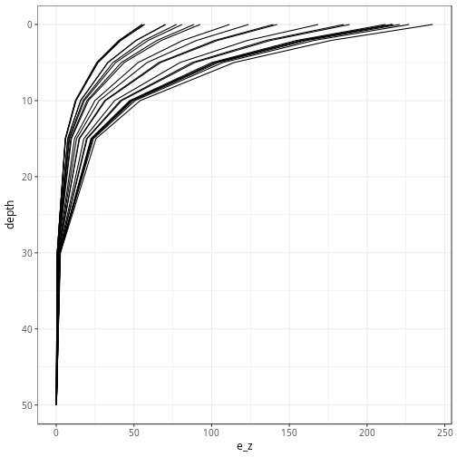
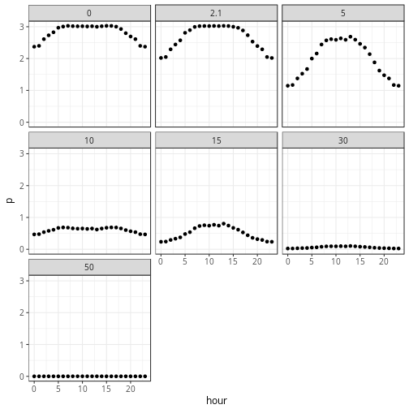
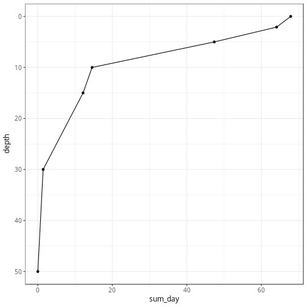

```r
# <><><><><><><><><><><><><><><><><><><><><><><><><><><><><><><><><><><><><><>  
# AUTHOR:       Philippe Massicotte
#
# DESCRIPTION:  Calculate PP based on P vs I curves.
# <><><><><><><><><><><><><><><><><><><><><><><><><><><><><><><><><><><><><><>

# *************************************************************************
# Open the PS file and do some cleaning
# *************************************************************************
ps <- readxl::read_excel("data/pp/Global_PS_for_Takuvik.xlsx") %>% 
  janitor::clean_names() %>% 
  mutate(time = anytime::anytime(paste(date, format(time, "%H:%M:%S")))) %>% 
  mutate(time_numeric = as.numeric(time)) %>% 
  mutate(hour = as.numeric(format(time, "%H"))) %>% 
  mutate(par_just_below_ice_scalar_µmolquanta_corrected = par_just_below_ice_scalar_µmolquanta)

# *************************************************************************
# There is a problem with data later than 2015-06-20 20:20:00.
# Replace these "outliers" with the observations measured at the begining.
# *************************************************************************
i <- which(ps$time >= "2015-06-20 20:20:00")

ps$par_just_below_ice_scalar_µmolquanta_corrected[i] <- 
  ps$par_just_below_ice_scalar_µmolquanta_corrected[length(i):1]

## Plot the "raw" data
ps %>% 
  ggplot(aes(x = time, y = par_just_below_ice_scalar_µmolquanta)) +
  geom_point() +
  geom_point(aes(y = par_just_below_ice_scalar_µmolquanta_corrected), col = "red")
```


```r
res <- ps %>% 
  group_by(hour) %>% 
  nest() %>% 
  mutate(e = map(data, ~pracma::trapz(1:6, .$par_just_below_ice_scalar_µmolquanta_corrected))) %>% 
  unnest(e)

res %>% 
  ggplot(aes(x = hour, y = e)) +
  geom_line() +
  geom_point()
```



```r
# kd ----------------------------------------------------------------------

compute_ez <- function(e) {

  kd <- -0.15 #m-1

  depth <- c(0, 2.1, 5, 10, 15, 30, 50)
  e_z <- e * exp(kd * depth)
  
  df <- data_frame(
    depth = depth,
    e_z = e_z
  )
    
  return(df)
}


res <- res %>% 
  mutate(ez = map(.$e, compute_ez)) %>% 
  unnest(ez)

res %>% 
  ggplot(aes(x = e_z, y = depth, group = hour)) +
  geom_line() +
  scale_y_reverse()
```



```r
# pi curve ----------------------------------------------------------------

params <- readxl::read_excel("data/pp/Calculs_PP_CTD47.xlsx") %>% 
  janitor::clean_names() %>% 
  rename(depth = depth_m) %>% 
  rename(tchl = tchl_a_mg_m3) %>% 
  rename(pmax = ps_mgc_m_3_h_1) %>% 
  rename(alpha = alpha_mgc_m_3_h_1_µmol_quanta_m_2_s_1_1) %>% 
  rename(beta = beta_b_mgc_3_h_1_µmol_quanta_m_2_s_1_1) 

dat <- inner_join(res, params, by = "depth") %>% 
  mutate(p = pmax * (1 - exp(-alpha * e_z / pmax)) * exp(-beta * e_z / pmax))

dat %>%
  ggplot(aes(x = hour, y = p)) +
  geom_point() +
  facet_wrap(~depth)
```



```r
dat %>%
  group_by(depth) %>% 
  summarise(sum_day = sum(p)) %>% 
  ggplot(aes(x = sum_day, y = depth)) +
  geom_point() +
  geom_line() +
  scale_y_reverse()
```



```r
res <- dat %>%
  group_by(depth) %>% 
  summarise(sum_day = sum(p))
```

## Calculate the integrated PP


```r
pracma::trapz(res$depth, res$sum_day)
```

```
## [1] 638.1606
```

```r
# *************************************************************************
# Export the data.
# *************************************************************************
write_csv(res, "data/pp_z.csv")
write_csv(dat, "data/pp_h.csv")
```

